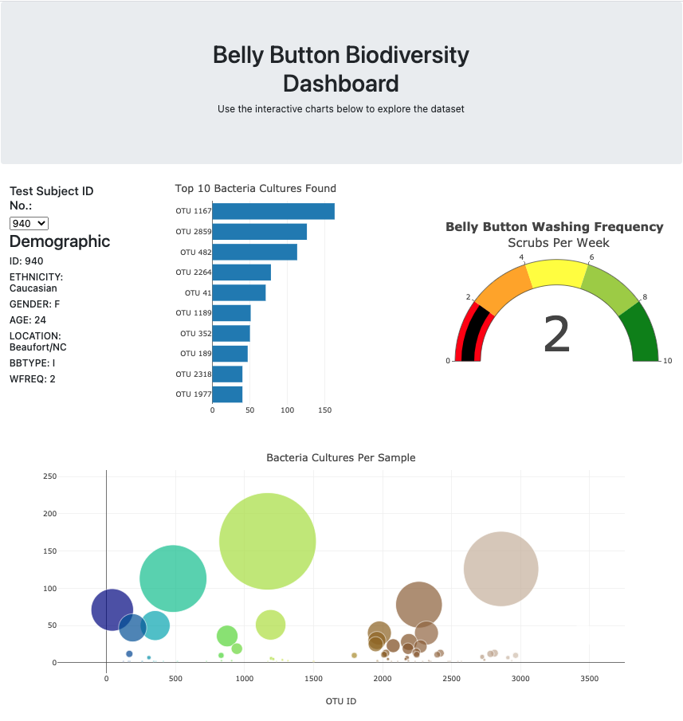
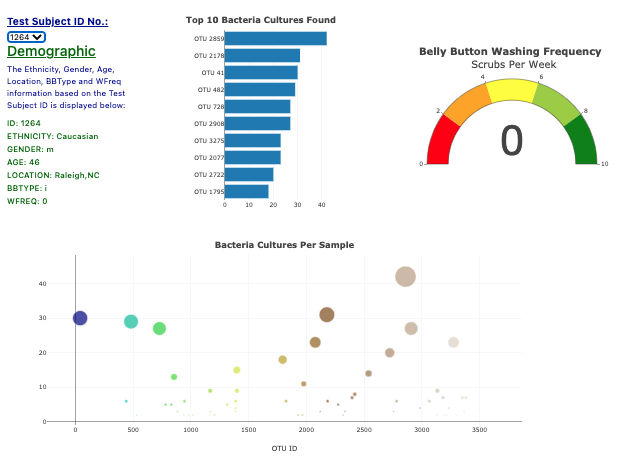
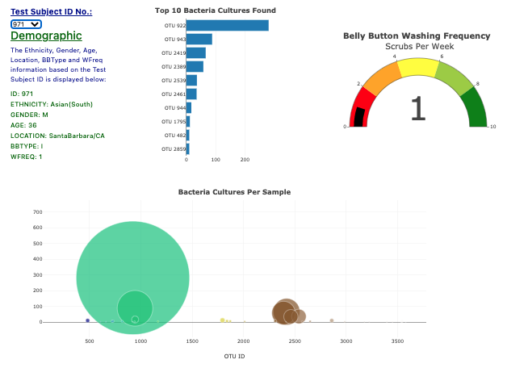
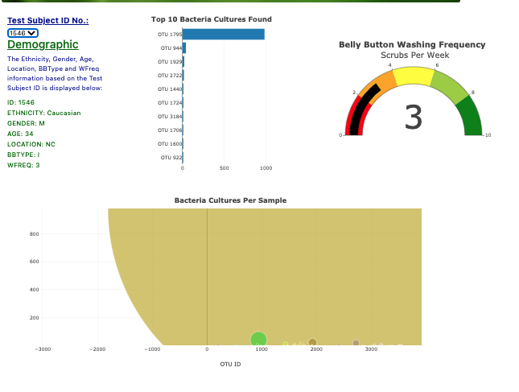
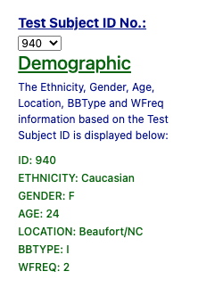
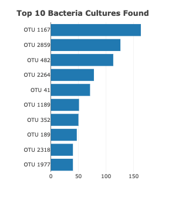
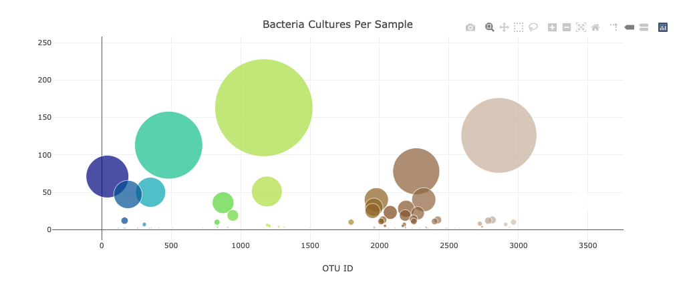

# Plotly_analysis
- An Belly Button Dashboard with a panel for demographic info with ability to display bacterial data for each individual to identify the top 10 bacteria in their belly button.

# Project overview:
- A dashboard has been designed using the data from the samples of some individuals to find the type and quantity of the bacterias found in the their belly buttons.
- By using HTML/CSS, Javascript, Plotly and D3.json() libraries, I have created a dashboard to present the top 10 bateria cultures found in a participant's belly button and their weekly washing freqency.

# Summary:
- The dashboard displays informations about an individual id selected from the dropdown menu:
  - ### Below are few examples with different ID's selection:
    
  
   
  
  
  
 ### Demographic Information: 
 - In the Demographics Info, all information of the selected id data is displayed.
 

### Bar Chart: 
- An ID is selected and top 10 bacterial species found in their belly button is visualized in bar chart.

### Bubble Chart: 
- The bubble chart helps to visualize the frequency of all bacterial species in volunteer.

### Gauge Chart: 
- The gauge chart shows wash frequency.
![guage_chart](./Resources/guage_chart.png